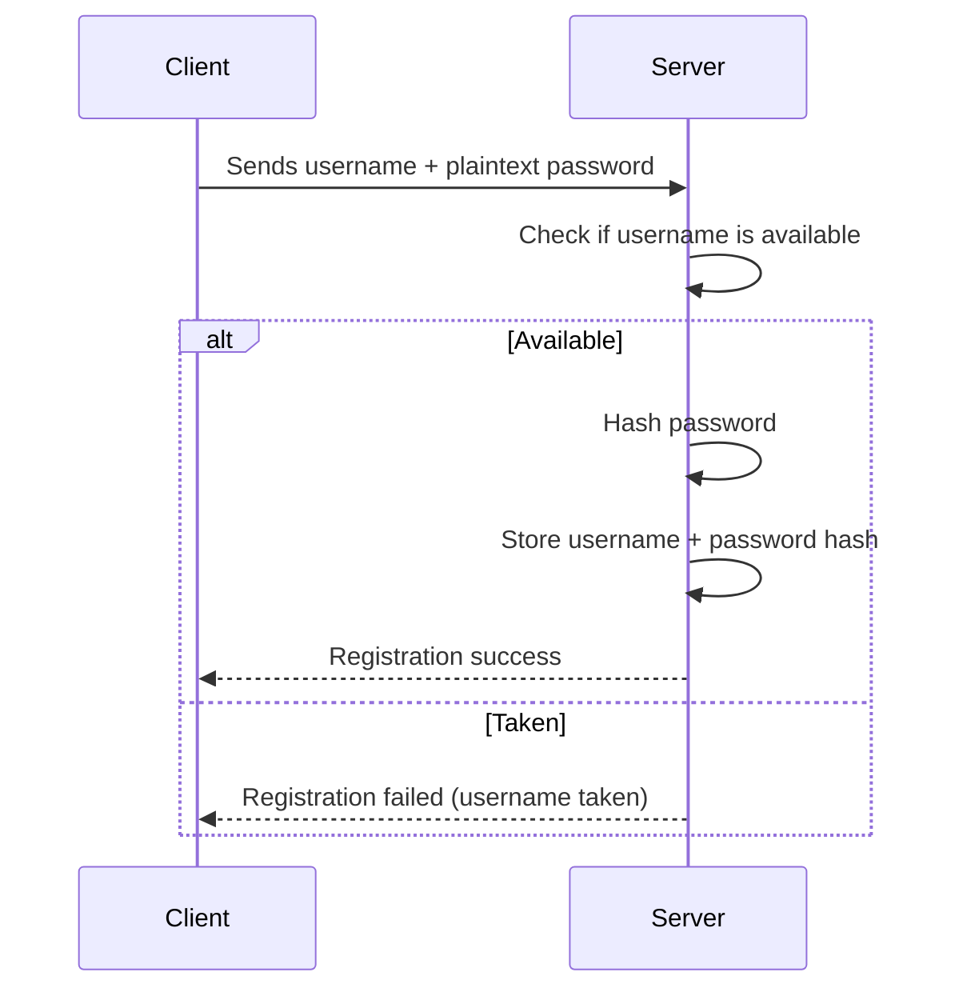
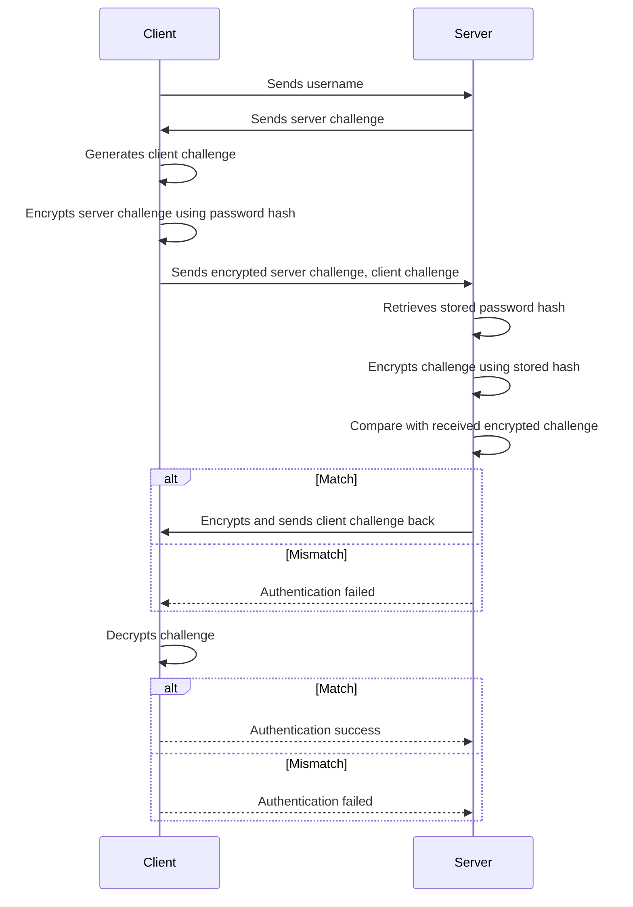

# Task: Implement Secure Login Challenge-Response System

## Summary

Implement the first step of secure login and user registration for the `login_server` service. This ensures that users are authenticated and registered without ever sending their password over the network. It uses a challenge-response method with encryption to validate identity and store secure credentials.

This task also includes writing clean unit tests using Python and `pytest` to validate behavior.

## Goals

* Create a module that handles login challenge.
* Create a module that handles registration.
* Add utilities to encrypt and compare authentication responses securely.
* Write test cases using `pytest`.
* Provide clear documentation and readable flow for future contributors. (Docstrings using [reST](https://sphinx-rtd-tutorial.readthedocs.io/en/latest/docstrings.html) format)

## How It Works

### Registration Flow

1. Client chooses a username and password.
2. Client sends the username and plaintext password to the server.
3. Server validates the username is available.
4. Server hashes the password and stores it securely with the username.

### Login Flow

1. Client connects to the server with only the username.
2. Server responds with a random challenge (nonce) and its public key.
3. Client generates its own random challenge.
4. Client encrypts the server's challenge using the password hash.
5. Client sends:
   * Encrypted server challenge
   * Client's own challenge
   * Username
6. Server retrieves the user's stored password hash.
7. Server encrypts its original challenge using that hash and compares the result.
8. If it matches, the server responds with an encrypted version of the client's challenge.
9. If the client can decrypt it correctly, mutual authentication is complete.

## Diagrams

### Registration Flow

### Login Flow

## Tests

Use `pytest`. Ensure the following:

* Each module is tested in isolation.
* Add positive and negative cases (correct and incorrect logins/registrations).
* Mock randomness where needed for predictable tests.

## Notes

* Do not use plain-text passwords anywhere beyond initial transmission for registration.
* Use standard libraries where possible.
* Tests must not rely on live randomness — mock or patch for determinism.
